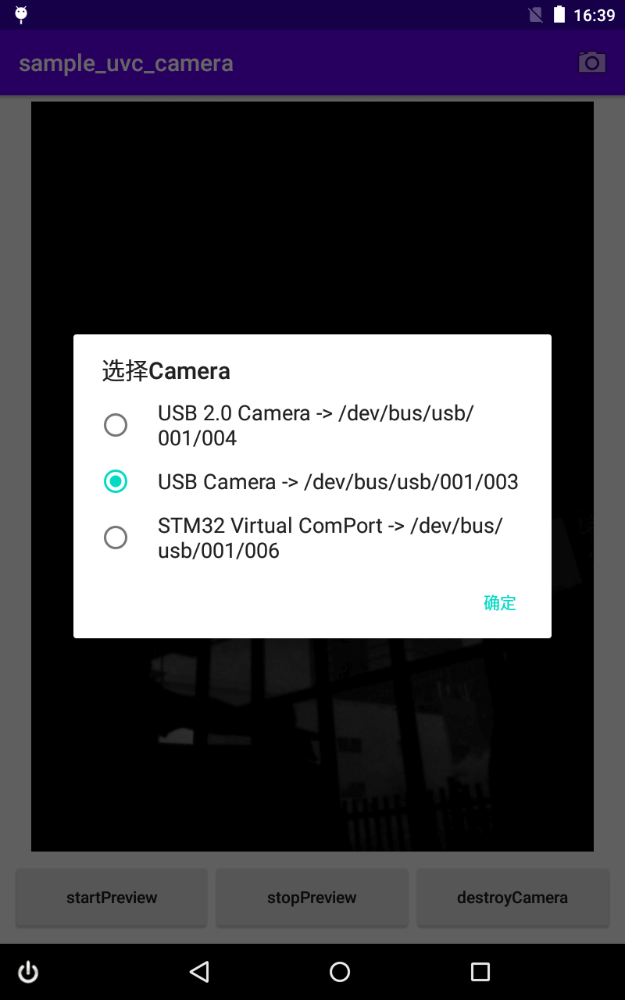
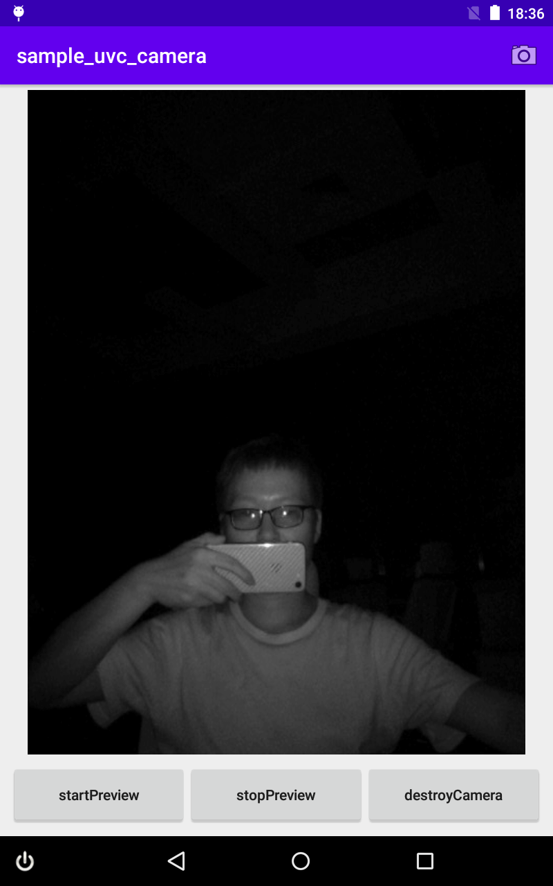
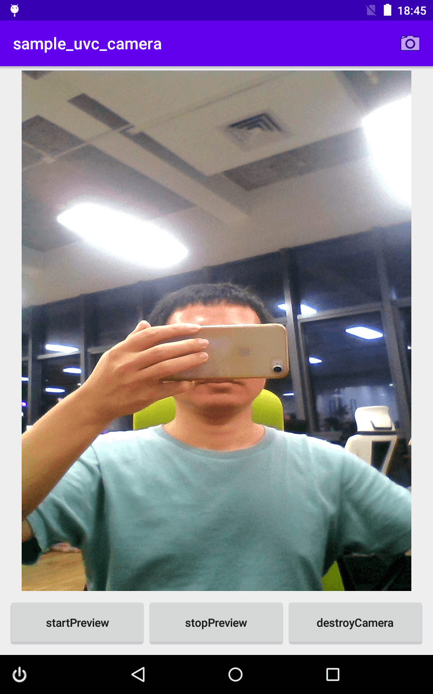

# android_camera_uvc
🔥 UVC Camera for Android.

### Image
  

### Demo
|  |
| :--------:                                   |
| Scan QR code or [Download][1]                |

### Features

### FAQ

### Build
- root build.gradle of project
```
repositories {
    maven { url "https://jitpack.io" }
}
```

- module build.gradle of project
```
implementation com.github.shengjunhu:camera_uvc:last
```

### Thanks
- [saki4510t/UVCCamera][2]
- [libjpeg-turbo][3]
- [libyuv][4]
- [libusb][5]
- [libuvc][6]

### About License
```
Copyright (c) 2020~2024 shengjunhu
Please comply with the relevant third party libraries license
```

[1]: https://github.com/shengjunhu/android_camera_uvc/raw/main/app/release/android_camera_uvc.apk
[2]: https://github.com/saki4510t/UVCCamera
[3]: https://github.com/libjpeg-turbo/libjpeg-turbo
[4]: https://chromium.googlesource.com/external/libyuv
[5]: https://github.com/libusb/libusb
[6]: https://github.com/libuvc/libuvc

